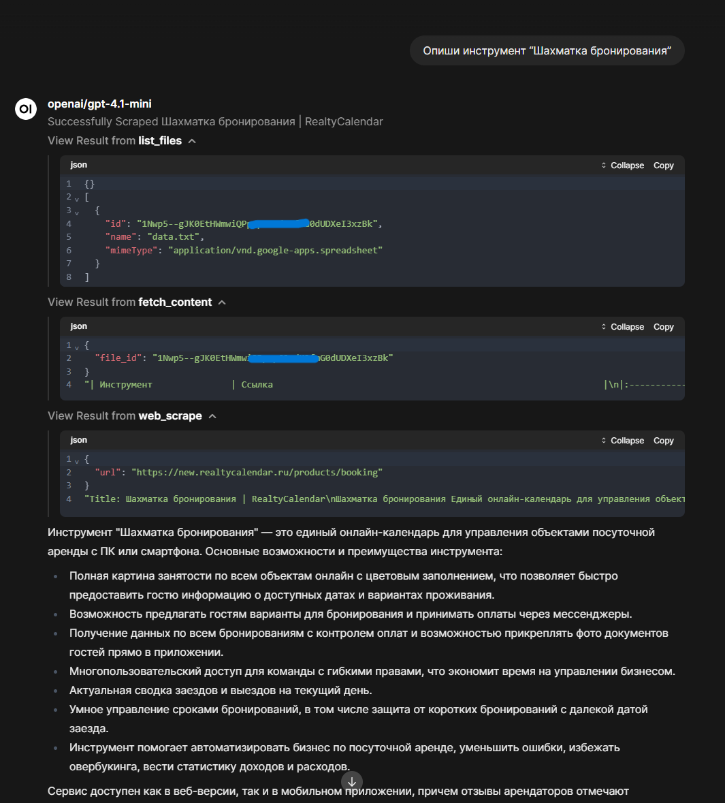

# GDRAG - A simple example/usecase of Google Drive integration feature in OpenWebUI.
## Content
This repo contains a docker project with the following services
- OpenWebUI - a working out of the box web interface for AI powered chatbots
- Ollama - a compatible model server with access to AI model ecosystem

Besides, a web scraping tool for OpenWebUI and its installation scripts are included.
## Features
Ollama + OpenWebUI based project where almost all the preinstallation done for you
- PRELOAD_MODELS env var allows to define models that would be fetched during build
- Web Scrape `httpx` tool empowers LLMs with text extraction capabilities
- Google Drive tool gives the model access to google drive files - it can get a list of files and read contents.
- Specifying GOOGLE DRIVE related ENV variables' values enables Google Drive integration with Picker API
## Installation
To install a OpenWebUI with Google Drive and Picker API integration, model web scraping capabilities follow these steps:
1. Follow the "Detailed instructions" section of the [original integration guide](https://docs.openwebui.com/features/rag/#google-drive-integration) up until step 11.
2. Enter the values of ENV variables in the `env_example` file and rename the file to `.env`
3. Build with docker compose using `local-compose.yaml`. You may want to edit the file to enable CUDA support for the panel. If so, follow the instructions within the file.
4. Access the web-panel on `localhost:3000` or any other port/address, if you made changes to the compose file.
5. Set `num_ctx=8192` and `function_calling=native` in model parameters to enhance performance in complex scenarios (Tested with Llama3.1:8b).

Note: Google drive tool (not the official picker) requires additional, independent actions:
1. Create a [service account](https://console.cloud.google.com/iam-admin/serviceaccounts) for your Agent in your Google Cloud project console.
2. Create a key for the service account and export it as JSON. Copy the Agent's email. 
3. Create a folder for the Agent on the GoogleDrive and share it with the agent by email. The agent will be able to access data only inside this folder.
4. In OpenWebUI open the Google Drive tool (in Workspace), click the gear icon and edit Valves. 
5. Insert the key JSON content and Folder ID (just copy it from the link to folder) into corresponding fields.
6. Click save.

Since these 2 Google Drive tools are independent, in fact, you may omit some of the steps, if you want to make it work just for the *unofficial* tool.

You, in that case, may want to set `ENABLE_GOOGLE_DRIVE_INTEGRATION=False` in the `.env` file or remove all Google Drive related fields from the .env.
Though, you still need a project in the Google Cloud with GoogleDrive API access.

## Example
Due to the hardware restrictions I have I decided to test with cloud hosted models, primarily GPT-4 mini and nano.
Works fine with both, though mini, obviously, is better.

In the following example we see how the model:
- Fetched the list of files from google drive
- Downloaded the content, a Google Sheet (don't mind that it has .txt extension, it's still a spreadsheet and would be the same for .xlsx or any other)
- Found a URL that is related, read the internet page.

